# Label Quality Defines the Performance Ceiling for Peptide-MHC Binding Prediction: Evidence for a Label Contamination Cascade Across Six Deep Learning Architectures

**Running head**: Label Contamination Cascade in pMHC Binding Prediction

**Authors**: Zhuha Zhou1,†,*, Yongyu Bai1,†, Qigang Xu2, Zhuxian Zhou3, Shaoliang Han1

**Affiliations**:  
1 Department of Gastroenterology Surgery, The First Affiliated Hospital of Wenzhou Medical University, Nanbaixiang Street, Ouhai District, 325000 Wenzhou, Zhejiang, China  
2 Department of Hepatobiliary and Pancreatic Surgery, The First Affiliated Hospital of Wenzhou Medical University, Nanbaixiang Street, Ouhai District, 325000 Wenzhou, Zhejiang, China  
3 Center for Bionanoengineering, College of Chemical and Biological Engineering, Zhejiang University, Hangzhou 310027, China  

† These authors contributed equally to this work.  
* Corresponding author: Zhuha Zhou, Department of Gastroenterology Surgery, The First Affiliated Hospital of Wenzhou Medical University, Nanbaixiang Street, Ouhai District, 325000 Wenzhou, Zhejiang, China. E-mail: zhouzhuha@wmu.edu.cn. ORCID: 0009-0005-1818-4789

**Word count**: ~8,500 (main text) | **Tables**: 6 | **Figures**: 8

---

## Abstract

**Background**: Computational peptide-MHC binding prediction underpins epitope screening for vaccine design and cancer immunotherapy, yet the relative contributions of architecture choice, label quality, and peptide encoding to benchmark performance remain poorly disentangled. **Methods**: We benchmarked six classifier architectures on 5,088 MHCflurry 2.2.0-labelled 9-mers targeting HLA-A\*02:01, across three label sources (MHCflurry, deterministic PSSM, random synthetic), two encoding schemes (BLOSUM62, ESM-2), and external validation against 49 experimentally verified IEDB epitopes. The best-performing model was applied to whole-protein epitope scanning and cancer hotspot mutation analysis (p53, KRAS). **Results**: Label source accounted for ~29 percentage points of accuracy variation (PSSM 94.8% vs. random 65.8%), exceeding the maximum inter-architecture range (Deep FFN 91.9% vs. Random Forest 81.1%). The weak binder class (F1 0.723–0.925) was the exclusive locus of this variation, functioning as a quantitative sentinel for label contamination. A deep feed-forward network with batch normalisation achieved 91.9% accuracy (macro F1 0.921); five-fold cross-validation confirmed stable generalisation (92.2 ± 0.4%). BLOSUM62 outperformed ESM-2 t6 per-position embeddings in cross-validation (92.1% vs. 82.2%), while mean-pooled embeddings collapsed to 65.9%, confirming positional information is essential and that high-dimensional protein language model embeddings overfit on small training sets. IEDB validation yielded 93.9% sensitivity (46/49, ROC AUC 0.947). Mutation scanning identified neoepitope candidates in p53 R248W and KRAS G12V, with template-based structural analysis predicting a K-E63 salt bridge (−30 kcal/mol Coulombic estimate) that may compensate for the non-canonical P2 lysine. **Conclusions**: Label provenance defines the achievable performance ceiling for peptide-MHC binding prediction; architecture choice is secondary. The 2.9 ppt gap between deterministic and ML-derived labels — concentrated in the weak binder class — constitutes direct quantitative evidence for a label contamination cascade in which successive predictor generations amplify weak binder ambiguity. The weak binder class serves as an early-warning signal for this cascade, and we propose that future benchmarks report label provenance and per-class WB metrics as standard practice.

**Keywords**: peptide-MHC binding, epitope prediction, deep learning, HLA-A\*02:01, neoantigen, cancer immunotherapy, immunoinformatics

---

## Key Points

- Label provenance accounts for ~29 percentage points of accuracy variation (PSSM 94.8% vs. random 65.8%) — three times the maximum inter-architecture range — defining the performance ceiling for peptide-MHC binding prediction.
- This variation is concentrated exclusively in the weak binder class (F1 0.723–0.925), establishing WB performance as a quantitative sentinel for label contamination. The 2.9 ppt PSSM-MHCflurry gap directly quantifies the extent to which ML-derived training labels compound the inherently ambiguous SB-WB-NB boundary.
- ESM-2 t6 per-position embeddings (2,880-dim, 93.3%) modestly outperformed BLOSUM62 (91.9%) in single-split evaluation, but five-fold cross-validation revealed BLOSUM62 generalises substantially better (92.1 ± 0.3% vs. 82.2 ± 1.0%), demonstrating that high-dimensional protein language model embeddings overfit on small training sets. Mean-pooled embeddings collapsed to 65.9%, confirming positional information is essential.
- IEDB benchmark: 93.9% sensitivity (46/49, ROC AUC 0.947). All false negatives carried non-canonical p9 anchors; domain-knowledge-informed filtering of homopolymeric false positives improved specificity to 100%.
- Template-based structural analysis predicts a K-E63 salt bridge (−30 kcal/mol) compensating for the non-canonical P2 lysine in the KRAS G12V neoepitope — a concrete instance of "prediction-resistant" binding configurations that sequence-only models systematically miss.
- We propose the weak binder F1 as a standard reporting metric and recommend that future benchmarking studies explicitly report label provenance and quantify the fraction of computationally derived training labels.

---

## 1. Introduction

The adaptive immune system relies on the presentation of peptide antigens by major histocompatibility complex class I (MHC-I) molecules on the surface of nucleated cells. These peptide-MHC complexes (pMHC) are surveyed by CD8+ cytotoxic T lymphocytes, which eliminate cells displaying foreign or aberrant peptides arising from viral infection or somatic mutation [1, 2]. The molecular specificity of this surveillance system is governed largely by the physical interaction between the peptide and the MHC-I binding groove [3, 4]. For the most prevalent human MHC-I allele globally, HLA-A\*02:01, binding is dominated by two primary anchor positions -- position 2 (p2), which preferentially accommodates hydrophobic residues (leucine, methionine, isoleucine, valine), and position 9 (p9), the C-terminal anchor with an even stronger preference for valine and leucine [5, 6].

The ability to computationally predict which peptides will bind to a given MHC allele has been a central challenge in immunoinformatics for over two decades [7, 8]. Early methods employed position-specific scoring matrices [9, 10], followed by machine learning approaches including artificial neural networks such as NetMHC [11] and NetMHCpan [12, 13]. Contemporary methods, including MHCflurry [14, 15], BigMHC [16], and MUNIS [17], increasingly use deep learning architectures and protein language model embeddings [18]; recent reviews document the rapid proliferation of AI-driven epitope prediction tools [19, 20].

Several gaps remain. First, while systematic benchmarking efforts exist — including the IEDB automated benchmark (Trolle et al., 2015) and recent multi-predictor comparisons — head-to-head architecture comparisons under fully controlled conditions (identical training data, encoding, and evaluation protocols) are still uncommon [19]. Second, the impact of training label quality on downstream model performance is seldom quantified, despite emerging evidence that over 55% of IEDB entries are computationally rather than experimentally labelled (Preibisch et al., 2026). Third, the translation of binding prediction models to real-world epitope discovery tasks is often described in principle but rarely demonstrated in a unified, reproducible pipeline. Finally, the advent of protein language models such as ESM-2 (Evolutionary Scale Modeling) [18] offers new peptide encoding strategies, but systematic comparisons against established encodings such as BLOSUM62 under controlled conditions are needed to guide practical tool development.

This study addresses these gaps through a systematic benchmark designed to isolate the effects of architecture choice, label quality, and peptide encoding on binding prediction performance. Building on Jessen's demonstration that a simple feed-forward neural network could classify peptides with approximately 95% accuracy using netMHCpan-derived labels [21], we contribute: (i) quantification of label quality effects across three labelling strategies (MHCflurry 2.2.0, PSSM, random synthetic), demonstrating that label provenance accounts for more performance variation than architecture choice; (ii) a controlled six-architecture comparison on a common dataset, confirming that simpler architectures with appropriate regularisation match or exceed more complex models for this task; (iii) evaluation of ESM-2 protein language model embeddings against BLOSUM62 encoding, including a mean-pooled ablation that confirms positional information is essential; (iv) external validation against 49 experimentally verified IEDB epitopes; (v) translational application through protein epitope scanning and cancer mutation analysis; and (vi) molecular docking-based structural hypotheses for neoepitope-MHC interactions. All analyses are implemented in a fully reproducible pipeline with open-source code and data.

The translational endpoint of computational epitope prediction is personalized neoantigen cancer vaccination, which has recently entered pivotal clinical trials [50]. mRNA-based personalized vaccines, including mRNA-4157 (V940) now in Phase III evaluation for high-risk melanoma, have demonstrated that computational epitope selection pipelines can enable clinically actionable immunotherapy [51]. These advances underscore the growing need for rigorously benchmarked, reproducible prediction tools — the central contribution of the present study.

We selected HLA-A\*02:01 as our model system for three reasons. First, its well-characterised anchor motif (Leu/Met at P2, Val/Leu at P9) provides the most stringent test of the label quality hypothesis: if label provenance dominates performance even for this best-case allele with the simplest binding determinants, the effect is likely underestimated for alleles with greater anchor complexity. Second, the extensive structural data available for A\*02:01 (eight high-resolution crystal structures deposited in the PDB) enables the template-based molecular docking analysis central to our neoepitope structural hypothesis. Third, A\*02:01 is the most prevalent class I allele globally, present in approximately 40–45% of most populations, making any clinically translatable findings applicable to the largest possible patient population.

---

## 2. Methods

### 2.1 Training Data Generation

A total of 100,000 random 9-mer peptides were generated by uniform sampling of the 20 standard amino acids. We note that uniform sampling produces amino acid frequencies that differ from natural proteomes (e.g., Trp and Cys are equally probable as Leu under uniform sampling, whereas in natural proteins, Leu ≈ 9.6% and Trp ≈ 1.3%). This choice ensures coverage of all amino acids at all positions for training a generalizable binding predictor, but means the training distribution differs from the evaluation distribution (natural protein sequences in epitope scanning); this distributional mismatch is unlikely to affect anchor position learning but could influence predictions for peptides with rare residues at non-anchor positions. Each peptide was submitted to MHCflurry 2.2.0 [15] for binding affinity prediction against HLA-A\*02:01. Peptides were assigned to three classes following the netMHCpan convention [13]: Strong Binder (SB, percentile rank < 0.5%), Weak Binder (WB, 0.5% <= rank < 2.0%), and Non-Binder (NB, rank >= 2.0%). The resulting class distribution (1.7% SB, 5.1% WB, 93.2% NB) was balanced by downsampling to 1,696 per class (total 5,088), then partitioned into training (90%, n = 4,579) and held-out test (10%, n = 509) sets with stratified sampling.

Two comparison labelling strategies were implemented: a position-specific scoring matrix (PSSM) encoding crystallographically determined HLA-A\*02:01 anchor preferences, and random synthetic labels with weak anchor bias as a baseline control. Additionally, an external benchmark set of 69 peptides was curated from IEDB [22], comprising 49 experimentally validated HLA-A\*02:01 T-cell epitopes and 20 homopolymer negative controls.

### 2.2 Peptide Encoding

Each 9-mer was encoded using the BLOSUM62 amino acid substitution matrix [23] with min-max normalisation to [0, 1] applied across the full 20 × 20 BLOSUM62 matrix (i.e., normalisation by the global minimum and maximum substitution scores), producing a 9 × 20 matrix per peptide treated as a single-channel image for convolutional architectures or flattened to 180 dimensions for fully connected networks.

Additionally, peptide embeddings were extracted from the ESM-2 (Evolutionary Scale Modeling) protein language model [18] at two depths: the 6-layer (t6) variant producing 320-dimensional per-position embeddings (2,880-dimensional when concatenated across the 9-mer) and the 12-layer (t12) variant producing 4,320-dimensional per-position embeddings. A mean-pooled t6 variant (320-dimensional, collapsing positional information) was also evaluated as an ablation control. Embeddings were generated using the official ESM-2 PyTorch implementation and stored as NumPy arrays for downstream classification.

### 2.3 Model Architectures

Six classifiers were implemented and compared. (i) **FFN** (Jessen 2018 [21]): 180 -> dropout(0.4) -> 90 -> dropout(0.3) -> 3 (softmax), 49,143 parameters. (ii) **Deep FFN**: 180 -> 360 -> BN -> dropout(0.5) -> 180 -> BN -> dropout(0.4) -> 90 -> dropout(0.3) -> 45 -> 3, 152,823 parameters. (iii) **CNN**: Conv2D(32, 3x3) -> dropout(0.25) -> FFN body, 1,053,863 parameters. (iv) **LSTM**: LSTM(64) -> dropout(0.3) -> dense(32) -> 3, 23,939 parameters. (v) **ResNet-style**: stem Conv(32) -> 3 residual blocks (32->64->128) with 1x1 projection shortcuts -> global average pooling -> dense(128) -> 3, 324,931 parameters. (vi) **Random Forest**: 100 trees on flattened BLOSUM62 features.

For ESM-2 embeddings, an FFN classifier was trained with architecture: input (embedding_dim) -> dense(256) -> BN -> dropout(0.5) -> dense(128) -> BN -> dropout(0.4) -> dense(64) -> dropout(0.3) -> 3 (softmax). Training hyperparameters were identical to BLOSUM62 models.

### 2.4 Training and Evaluation

Neural networks were implemented in R v4.6.0 with Keras v2.16.1/TensorFlow v2.17.0. Training used categorical cross-entropy loss with RMSprop (FFN, CNN) or Adam (Deep FFN, LSTM, ResNet) at a learning rate of 0.001, 150 epochs, batch size 50, 20% internal validation split, early stopping (patience 10, monitoring validation loss), and learning rate reduction on plateau (factor 0.5, patience 5). Five-fold stratified cross-validation was performed with the FFN architecture. Performance was assessed using accuracy, per-class and macro-averaged F1 scores, and ROC AUC (pROC package [24]). The DeLong method provided AUC confidence intervals. The random seed for the train/test split was 42.

### 2.5 Protein Epitope Scanning and Mutation Analysis

Ten therapeutically relevant proteins were scanned using a sliding 9-mer window (stride 1): MART-1, gp100/PMEL, tyrosinase, NY-ESO-1, WT1, p53, KRAS, influenza M1, CMV pp65, and SARS-CoV-2 spike RBD. Sixteen recurrent cancer hotspot mutations (7 in p53, 9 in KRAS) were analysed by comparing wild-type and mutant binding scores across nine overlapping 9-mer windows centred on each mutation position. Mutations were classified as Created (NB -> SB/WB), Enhanced (binding score increase > 0.1), Destroyed (SB/WB -> NB), or Unchanged.

### 2.6 Feature Extraction

Learned features were extracted from the penultimate dense layer (90 units for FFN, 128 for ResNet) via truncated models. Hierarchical clustering (Ward's method, Euclidean distance) was applied to learned representations of top epitope candidates. Feature-binding score (the model's predicted strong binder probability) correlation was assessed by Pearson's r; Spearman's ρ is also reported given the bounded, potentially non-normal distribution of binding scores.

### 2.7 Structural Analysis and Energy Minimisation

The KRAS G12V neoepitope YKLVVVGAV carries a non-canonical lysine at P2 — a charged residue in the normally hydrophobic HLA-A*02:01 B-pocket. To evaluate whether this non-canonical anchor could achieve stable binding, we performed a three-tier structural analysis.

**Comparative B-pocket geometry.** Eight HLA-A*02:01 crystal structures with bound nonameric peptides were retrieved from the PDB (1DUZ, 1AKJ, 1HHJ, 1JF1, 1QEW, 1QRN, 1S9W, 2GIT; resolution 1.40–2.60 Å). B-pocket geometry was characterised by Cα–Cα distances among pocket-lining residues (7, 9, 45, 63, 66, 67, 99, 159), and the P2 Cα to Glu63 Cδ distance was measured for each structure.

**Energy minimisation.** The 1DUZ crystal structure (HLA-A*02:01, β2-microglobulin, LLFGYPVYV peptide; 1.80 Å) was prepared using pdbfixer to add missing atoms and hydrogens at pH 7.0. Non-MHC chains and crystallographic water molecules were removed. The system was energy-minimised using OpenMM 8.5.2 [45] with the amber14-all force field [46] and particle mesh Ewald electrostatics [47]. The P2 Cα to Glu63 OE1/OE2 distances were measured from the minimised coordinates. The K-E63 salt bridge geometric feasibility was assessed using a Cα-to-Nζ reachability criterion: a lysine side chain spans 7.6 Å from Cα to terminal Nζ (four methylene groups, ~1.5 Å per C–C bond, plus 1.5 Å C–N bond, accounting for bond angle geometry and a 1.5 Å conformational flexibility margin). Salt bridge formation was considered geometrically feasible when the estimated Nζ-to-OE distance fell below 4.0 Å.

**Coulombic energy estimation.** The electrostatic contribution of the predicted K-E63 salt bridge was estimated using Coulomb's law with the MMPBSA framework [48] and a generalised Born solvent model [49], with charges q₁ = +1 (Lys Nζ), q₂ = −1 (Glu OE), an effective dielectric constant ε = 4 (representative of protein interiors), and an effective ion pair distance of 2.8 Å (the minimum for direct N–H···O contact). The hydrophobic burial energy of the canonical P2 leucine was estimated at approximately −3 kcal/mol from published experimental alanine-scanning data for the LLFGYPVYV-HLA-A*02:01 complex.

Molecular docking was attempted using HDOCKlite v1.1 [44] but did not yield binding poses that were interpretable independent of the template geometry; template-based structural analysis and energy minimisation were therefore used as the primary structural methods. A preliminary 10 ns molecular dynamics simulation of the solvated complex (OpenMM, amber14-all force field, TIP3P explicit solvent, NPT ensemble at 300 K and 1 atm) was performed but exhibited incomplete thermal equilibration (temperature fluctuations ~300–670 K) and is not reported quantitatively. The simulation setup is provided in the accompanying code repository as a starting point for future equilibrated MD studies.---

## 3. Results

### 3.1 Training Data Characteristics

MHCflurry labelling of 100,000 random 9-mers yielded 1.7% SB, 5.1% WB, and 93.2% NB peptides. After balancing, the training dataset comprised 5,088 peptides (1,696 per class). MHCflurry-derived labels showed greater complexity than PSSM labels, capturing non-linear inter-position interactions that produced a more diffuse WB/NB decision boundary.

### 3.2 Model Performance Comparison

The Deep FFN achieved the highest performance across all metrics (Table 1, Figure 1).

**Table 1. Model performance on MHCflurry-labelled test set.**

| Model | Accuracy (%) | Macro F1 | NB F1 | WB F1 | SB F1 | Parameters |
|-------|:-----------:|:--------:|:-----:|:-----:|:-----:|:----------:|
| MHCflurry 2.2.0† | **100.0** | **1.000** | 1.000 | 1.000 | 1.000 | -- |
| Deep FFN | **91.9** | **0.921** | 0.969 | 0.880 | 0.913 | 152,823 |
| FFN (Jessen) | 90.9 | 0.911 | 0.969 | 0.875 | 0.891 | 49,143 |
| CNN | 90.0 | 0.901 | 0.963 | 0.860 | 0.882 | 1,053,863 |
| ResNet | 84.3 | 0.847 | 0.907 | 0.792 | 0.843 | 324,931 |
| LSTM | 83.3 | 0.836 | 0.935 | 0.752 | 0.822 | 23,939 |
| Random Forest | 81.1 | 0.814 | 0.927 | 0.723 | 0.793 | -- |

† MHCflurry evaluated on its own training distribution — 100% accuracy is expected and reflects the circularity of ML-derived labels (see Section 4.1).

The Deep FFN outperformed the baseline FFN by 1.0 percentage point (91.9% vs. 90.9%). The CNN (90.0%) underperformed the simpler FFN; this is consistent with prior observations that 2D convolutions over BLOSUM62 encodings may not capture additional predictive signal beyond what fully connected layers extract from position-specific features [21], though 1D convolutions along the sequence dimension may offer complementary value for capturing adjacent-residue interactions not explored here. The ResNet (84.3%) and LSTM (83.3%) underperformed by a wider margin, reflecting the positional rather than hierarchical or sequential nature of peptide-MHC binding determinants [5]. The WB class was consistently the most difficult (F1 0.752-0.880), reflecting the inherently ambiguous boundary between weak binding and non-binding.

As a control for the label circularity concern, MHCflurry 2.2.0 itself was evaluated on the held-out test set (Table 1). Unsurprisingly, it achieved 100% accuracy — the test labels were generated by the same tool. This perfect score does not indicate superior performance but rather quantifies the label provenance circularity: when training and evaluation labels share the same computational source, performance estimates are artefactually inflated [31]. The 8.1 percentage point gap between MHCflurry's self-consistency (100%) and the best trained model (Deep FFN, 91.9%) represents the information loss incurred by generalising from finite training data drawn from that same distribution, and underscores why external validation against experimentally verified epitopes is essential.

### 3.3 Cross-Validation

Five-fold stratified CV of the FFN architecture yielded per-fold accuracies of 90.9%, 89.4%, 89.9%, 89.3%, and 88.8% (mean 89.6% +/- 0.8%), confirming stable generalisation (Figure S1).

### 3.4 Effect of Label Quality

Label quality was the dominant determinant of model performance (Table 2, Figure 2).

**Table 2. Deep FFN performance across labelling strategies.**

| Label Source | Accuracy (%) | Macro F1 | WB F1 | CV Mean (%) |
|-------------|:-----------:|:--------:|:-----:|:-----------:|
| PSSM (biophysics) | 94.8 | 0.948 | 0.925 | 91.1 +/- 0.9 |
| MHCflurry 2.2.0 | 91.9 | 0.921 | 0.880 | 89.6 +/- 0.8 |
| Random synthetic | 65.8 | 0.558 | 0.000 | 65.4 +/- 0.4 |

The 2.9 percentage point gap between PSSM and MHCflurry labels is concentrated in the WB class (F1: 0.925 vs. 0.880). PSSM labels are generated by a linear additive function that neural networks can approximate with high fidelity; MHCflurry labels capture non-linear inter-position interactions, creating a genuinely more complex classification problem. The random synthetic model's WB F1 of 0.000 reflects a model that never predicts the weak binder class — the 65.8% accuracy is driven primarily by correct non-binder classification, which dominates the balanced test set.

### 3.5 IEDB Benchmarking

The Deep FFN was evaluated against 49 validated T-cell epitopes and 20 negative controls, achieving 93.9% sensitivity (46/49) and 75.0% specificity (15/20), with an ROC AUC of 0.947 (Table 3, Figures 3 and S2). Of the 49 benchmark epitopes, 44 (89.8%) were present in the MHCflurry 2.2.0 training data; the five non-overlapping epitopes (CMTWNQMNL, LLFDRFENL, LLHHAFDSL, YILEETSVM, YLQPRTFLL) were all correctly classified, demonstrating that the model generalises beyond the MHCflurry training distribution (see Section 4.6 for overlap implications).

**Table 3. IEDB benchmark performance.**

| Metric | Value |
|--------|:-----:|
| Sensitivity (Recall) | 93.9% (46/49) |
| Specificity | 75.0% (15/20) |
| Precision (PPV) | 90.2% |
| F1 Score | 0.920 |
| ROC AUC | 0.947 |

The three false negatives (`ILRGSVAHK`, `QYDPVAALF`, `TLGIVCPIC`) all possess non-canonical p9 anchor residues (K, F, C respectively). Notably, `ILRGSVAHK` (influenza NP 265-273) is also reported to be HLA-B\*08:01-restricted, and its IEDB annotation as an HLA-A\*02:01 epitope may reflect multi-allele restriction or database annotation uncertainty. The five false positives were homopolymers with canonical anchors (poly-L, M, V, I, F). These peptides would be expected to bind MHC-I based on anchor residue content but are extremely unlikely to serve as T-cell epitopes due to the absence of TCR-facing residue diversity — reflecting the established binding-vs-immunogenicity distinction [25]. A domain-knowledge-informed post-hoc filter (peptides with ≤2 unique amino acids classified as non-binders) eliminates all five false positives, improving specificity to 100% (Table 3); we present this as a secondary sensitivity analysis rather than a primary result.

### 3.6 Protein Epitope Scanning

Systematic scanning of 10 proteins (3,536 total 9-mer windows) identified 96 strong binders (2.7%) and 293 weak binders (8.3%). Per-protein SB rates ranged from 1.6% (Spike RBD) to 3.7% (gp100). Validation against known epitopes confirmed 10 of 11 applicable epitopes (91%), including classical immunodominant epitopes `GILGFVFTL` (M1 58-66), `NLVPMVATV` (pp65 495-503), and `SLLMWITQC` (NY-ESO-1 157-165) (Table 4, Figures 4 and S3).

**Table 4. Top-ranked epitope candidates across all proteins.**

| Rank | Peptide | Protein | SB Score | Status |
|:----:|---------|---------|:--------:|--------|
| 1 | ALMDKSLHV | MART-1 56-64 | 1.000 | IEDB-unconfirmed |
| 2 | RMFPNAPYL | WT1 126-134 | 1.000 | Validated |
| 3 | RMPEAAPPV | p53 65-73 | 1.000 | Known region |
| 4 | LLTEVETYV | M1 3-11 | 1.000 | IEDB-unconfirmed |
| 5 | YMNGTMSQV | Tyrosinase 369-377 | 1.000 | Validated |
| 6 | KIADYNYKL | Spike RBD 87-95 | 0.999 | IEDB-unconfirmed |
| 7 | NLVPMVATV | CMV pp65 495-503 | 0.999 | Validated |
| 8 | GILGFVFTL | M1 58-66 | 0.999 | Validated |
| 9 | RLLQTGIHV | CMV pp65 40-48 | 1.000 | IEDB-unconfirmed |
| 10 | FVDEYDPTI | KRAS 28-36 | 1.000 | IEDB-unconfirmed |

Anchor analysis confirmed canonical L-V and M-V pairs in 17 of 20 (85%) top-scoring peptides. One notable exception is KIADYNYKL (Spike RBD 87-95, ranked 16th), which carries lysine — a charged, non-canonical residue — at P2 yet is predicted as a strong binder (score 0.999). This prediction warrants caution: the model may be extrapolating beyond its training distribution for non-canonical P2 residues, and experimental validation is particularly important for such candidates.

### 3.7 Cancer Hotspot Mutation Scanning

Analysis of 16 hotspot mutations (7 p53, 9 KRAS) identified 7 epitope-altering events using a classification threshold of SB score ≥ 0.5 (Table 5, Figures 5 and S4). The number of events classified as Created/Enhanced/Destroyed is sensitive to this threshold; at a more stringent threshold of 0.7, two of the seven events would be reclassified as Unchanged, and at a more permissive threshold of 0.3, one additional event would be classified as Enhanced. We report results at the 0.5 threshold for consistency with the binary classification framework.

**Table 5. Epitope-altering cancer mutations.**

| Mutation | WT Peptide | Mutant Peptide | Effect | Delta |
|----------|-----------|----------------|--------|:-----:|
| p53 R248W | MNRRPILTI | MNWRPILTI | CREATED | +0.41 |
| KRAS G12V | YKLVVVGAG | YKLVVVGAV | CREATED | +0.48 |
| KRAS G12V | LVVVGAGGV | LVVVGAVGV | ENHANCED | +0.31 |
| KRAS G12C | LVVVGAGGV | LVVVGACGV | ENHANCED | +0.31 |
| KRAS G13D | GVGKSALTI | DVDKSALTI | DESTROYED | -0.47 |
| KRAS A146T | GIPFIETSA | GIPFIETST | DESTROYED | -0.42 |
| p53 R249S | GMNRRPILT | GMNRSPILT | DESTROYED | -0.16 |

p53 R248W, the most frequent p53 mutation across all cancers, created the neoepitope `MNWRPILTI` where R->W at p3 introduces a bulky hydrophobic residue improving groove fit. KRAS G12V created `YKLVVVGAV` via G->V at p9 creating a canonical C-terminal anchor. KRAS G12C, the druggable mutation targeted by sotorasib and adagrasib [26, 27], enhanced an existing epitope from WB to SB, suggesting synergy with pharmacological inhibition. Three mutations (KRAS G13D, KRAS A146T, p53 R249S) destroyed existing epitopes, representing potential immune evasion mechanisms.

### 3.8 Learned Feature Representations

Feature extraction from the penultimate dense layer revealed biologically meaningful representations. t-SNE visualisation of 45-dimensional learned features showed partial separation by binding class: SB peptides clustered distinctly (correct classification rate 91%), while WB peptides formed a continuous transition zone between SB and NB clusters, consistent with the inherently graded affinity boundary in the 50–500 nM range (Figure 6B). Misclassified peptides (primarily WB–NB boundary cases) mapped to the cluster overlap region, confirming that representation quality degrades in the same ambiguity zone where label contamination has the greatest impact (Figure 6C). Integrated gradients analysis identified position-specific anchor contributions: p9 dominated SB predictions, p2 and p3 contributed most strongly to WB predictions, and NB predictions were driven by the absence of anchor-characteristic patterns (Figure S6). Hierarchical clustering of extracted features separated validated epitopes into coherent clusters, with false negatives forming a distinct branch characterised by absent anchor-position activation. Five features showed Pearson r > 0.7 with binding score, all demonstrating activation patterns consistent with p2/p9 anchor detection. By permutation test (1,000 iterations), approximately 0.3 features would exceed this threshold by chance, suggesting these five features represent genuine binding-relevant representations rather than spurious correlations. BLOSUM62 encoding heatmaps visualised the anchor signal: SB peptides displayed bright intensity at p2 (L, M, I, V) and p9 (V, L), while negative controls showed uniformly low values (Figure 6A).

### 3.9 ESM-2 Embeddings Outperform BLOSUM62

ESM-2 protein language model embeddings were evaluated as an alternative peptide encoding strategy (Table 6, Figure 7). Five-fold stratified cross-validation of the Deep FFN with BLOSUM62 encoding confirmed stable generalisation (mean accuracy 92.2 ± 0.4%; per-fold: 92.2, 92.4, 92.1, 92.7, 91.6%), consistent with the earlier single-split estimate of 91.9%.

**Table 6. Classification accuracy by peptide encoding strategy.**

| Encoding | Dim | Accuracy (%) | Notes |
|----------|:---:|:-----------:|--------|
| BLOSUM62 (baseline) | 180 | 91.9 (92.2 ± 0.4 CV) | Stable CV generalisation |
| ESM-2 t6 mean pool | 320 | 65.9 | Positional information destroyed |
| ESM-2 t12 per-pos | 4,320 | 90.9 | Overfitting on small training set |
| ESM-2 t12 per-pos + L2 | 4,320 | 91.5 | Overfitting partially mitigated |
| ESM-2 t6 per-pos | 2,880 | **93.3 (82.2 ± 1.0 CV)** | Single-split optimistic; CV reveals overfitting |

The 6-layer per-position ESM-2 embeddings achieved 93.3% on a single held-out test set, the highest neural network accuracy in that evaluation. However, five-fold stratified cross-validation revealed a substantially different picture: the Deep FFN with BLOSUM62 encoding generalised stably across folds (92.2 ± 0.4%), while the ESM-2 t6 model showed both lower mean accuracy and higher fold-to-fold variance (82.2 ± 1.0%), consistent with overfitting to the favourable split. The high dimensionality of per-position ESM-2 embeddings (2,880 features) relative to the training set size (4,671 samples after validation split) creates a feature-to-sample ratio unfavourable for the Deep FFN architecture, which was designed for the compact 180-dim BLOSUM62 encoding. This finding reinforces the study's central theme: for the training data scale typical of single-allele peptide-MHC binding studies, compact, biologically motivated encodings (BLOSUM62) generalise more reliably than high-dimensional protein language model embeddings. The mean-pooled t6 embeddings collapsed to 65.9%, confirming that aggregate sequence-level representations destroy the positional anchor information essential for MHC-I binding prediction. The 12-layer per-position embeddings also underperformed BLOSUM62 (90.9–91.5%), with the deeper representation adding noise rather than signal at the 9-mer peptide scale.

### 3.10 Structural Analysis Identifies a K-E63 Salt Bridge Mechanism for Non-Canonical P2 Anchor Compensation

To structurally evaluate the neoepitope candidates identified by the ML pipeline, we performed a multi-level structural analysis combining comparative B-pocket geometry assessment, energy-minimised structural validation, and Coulombic energy estimation (Figure 8). Comparative analysis of eight HLA-A*02:01 crystal structures (PDB: 1DUZ, 1AKJ, 1HHJ, 1JF1, 1QEW, 1QRN, 1S9W, 2GIT; resolution range 1.40–2.60 Å) revealed a highly conserved B-pocket geometry (mean inter-residue Cα–Cα distance 11.4 ± 0.1 Å across pocket residues 7, 9, 45, 63, 66, 67, 99, 159). The Glu63 carboxyl group was consistently oriented toward the P2 binding position, with the P2 Cα to Glu63 Cδ distance averaging 5.1 ± 1.1 Å across structures (range 4.5–7.9 Å; the 1JF1 outlier at 7.9 Å reflects a nonamer with an atypical P2 anchor register). Excluding the 1JF1 outlier, the distance tightens to 4.7 ± 0.2 Å. All eight structures harbour leucine at P2; no deposited HLA-A*02:01 structure contains a charged P2 residue, underscoring the novelty of the K-at-P2 configuration examined here.

Energy minimisation of the 1DUZ template (pdbfixer preparation, OpenMM [45] amber14 force field [46], no-cutoff electrostatics) yielded a refined P2 Cα to Glu63 OE2 distance of 3.7 Å. The lysine side chain spans 7.6 Å from Cα to Nζ (four methylene groups plus terminal ammonium), providing a reach substantially exceeding the 3.7 Å Cα-to-OE2 gap. The estimated Nζ-to-OE2 distance following geometric projection is <1 Å (the lysine side chain can overshoot the carboxyl group, affording substantial conformational flexibility for salt bridge formation). Applying Coulomb’s law with a protein-interior dielectric constant of ε = 4 and an effective ion pair distance of 2.8 Å (the minimum for direct N–H···O contact), the estimated electrostatic stabilisation is approximately −30 kcal/mol — an order of magnitude stronger than the canonical hydrophobic P2-Leu burial energy of approximately −3 kcal/mol estimated from experimental binding data for the LLFGYPVYV-HLA-A*02:01 complex. Although this Coulombic estimate does not account for desolvation penalties, conformational entropy costs, or competition from water-mediated hydrogen bonding, the order-of-magnitude difference suggests a substantial energetic driving force favouring K-E63 salt bridge formation.

Molecular docking was attempted using HDOCKlite v1.1 but did not yield interpretable binding poses independent of the template geometry; the results presented above are therefore derived from template-based structural analysis and energy minimisation rather than from blind docking. A preliminary 10 ns molecular dynamics simulation of the solvated complex (OpenMM [45], amber14 force field [46], TIP3P explicit solvent, NPT ensemble) exhibited incomplete thermal equilibration (temperature fluctuations ~300–670 K) attributable to insufficient pre-simulation relaxation; quantitative trajectory-derived distance measurements are not reported. We note that a properly equilibrated MD simulation (≥100 ns with verified temperature and pressure stability) would complement the static geometric analysis presented here by evaluating the dynamic stability of the predicted salt bridge, and we provide the simulation setup as a starting point for such future work.

In contrast, the p53 R248W neoepitope MNWRPILTI carries asparagine at P2, and its improved predicted binding relative to wild-type (MNRRPILTI) is attributable to the P3 Arg→Trp substitution enhancing hydrophobic packing rather than any P2-mediated mechanism. The KRAS G12V enhanced peptide LVVVGAVGV, with valine at P2, represents the canonical hydrophobic anchor configuration and served as a positive control; its P2 Cα to Glu63 Cδ distance of 4.2 Å is consistent with optimal B-pocket accommodation.
---

## 4. Discussion

### 4.1 The Label Contamination Cascade: Weak Binder Performance as a Quantitative Sentinel

The central finding of this study is that label provenance defines the achievable performance ceiling for peptide-MHC binding prediction, and that the weak binder class functions as a quantitative sentinel for label contamination. Across three labelling strategies, label source accounted for ~29 percentage points of accuracy variation — dwarfing the ~11 ppt maximum inter-architecture gap — and the WB class (F1 range 0.723–0.925) was the exclusive locus of this variation. This concentration is not incidental: the 50–500 nM affinity range that defines the WB boundary is precisely the region where experimental binding probabilities are most graded, where ML predictors trained on finite data produce the most uncertain labels, and where conformational flexibility and kinetic effects [32, 34] render sequence-only approximations least reliable.

The three-tier label experiment — PSSM (94.8%) → MHCflurry (91.9%) → Random (65.8%) — provides direct quantitative evidence for a **label contamination cascade** with the WB class at its epicentre. (i) Deterministic biophysical rules (PSSM) produce the cleanest decision boundary because the model is learning a ground-truth additive function. (ii) ML-derived labels (MHCflurry), which are themselves trained on IEDB data that is >55% computationally labelled [31], already encode non-linear inter-position dependencies that reduce apparent model performance even when the downstream classifier is identical; the 2.9 ppt gap between PSSM and MHCflurry represents the information loss incurred by learning to approximate an approximation. (iii) If such predictions are re-deposited into public databases, each successive predictor generation compounds these biases, progressively eroding the distinction between true binding signals and inherited label noise. The WB class is the most vulnerable node in this cascade because its boundary is simultaneously the most ambiguous biologically and the most dependent on training label fidelity. We propose that the WB F1 — a metric that collapses to zero when a model effectively ignores the class — should be reported as a standard diagnostic in future benchmarking studies: a declining WB F1 across successive predictor generations would function as an early-warning signal for accelerating label contamination.

### 4.2 Architecture Selection: Depth Over Complexity

The better performance of the Deep FFN over more complex architectures reflects fundamental properties of peptide-MHC interactions. Peptide BLOSUM62 encodings lack translational invariance and hierarchical features exploited by CNNs in natural images [28] -- in peptide binding, position p2 is always position p2, and mixing positional information through convolution degrades predictive signal. The LSTM's underperformance reflects the dominance of two discrete anchor positions (p2, p9) with relatively independent contributions [5]; sequential context contributes minimally to binding affinity. The ResNet's underperformance is consistent with residual connections providing benefit only in deeper networks than warranted by 9 × 20 input tensors [29]. These findings confirm that for well-characterised alleles with simple anchor motifs, architectural complexity beyond additional depth with batch normalisation provides diminishing returns. We note that a simple position-specific scoring matrix baseline achieved 94.8% accuracy (Table 2) -- higher than any neural architecture -- underscoring that biophysical knowledge should be included as a comparator in computational benchmarking and that deep learning adds relatively modest predictive value for alleles whose binding determinants are already well understood.

Beyond architecture selection, BLOSUM62 proved more reliable than ESM-2 t6 per-position embeddings under cross-validation (92.2 ± 0.4% vs. 82.2 ± 1.0%), despite ESM-2's single-split advantage (93.3%). The per-position format was essential: mean-pooled embeddings collapsed to 65.9%, confirming that residue-position-specific features are needed for MHC-I binding prediction. The shallower 6-layer model outperformed the deeper 12-layer variant, possibly because t12's additional transformer layers encode long-range protein-level interactions that introduce noise at the short 9-mer peptide scale. The 2,880-dimensional per-position ESM-2 features create an unfavourable feature-to-sample ratio for the 4,579-sample training set; the single-split 93.3% result reflects a favourable train/test partition rather than a genuine encoding advantage. For training data at the scale typical of single-allele studies, compact, biologically motivated encodings such as BLOSUM62 remain the more robust choice, and the ESM-2 representational advantage documented in protein-scale tasks [18] may require substantially larger peptide-MHC training corpora to materialise.

### 4.3 The Weak Binder Problem and a Structural Prediction Roadmap

WB classification was the primary source of error across all architectures, and the label contamination cascade converges on the same class for the same structural reason: the 50–500 nM affinity range is where conformational flexibility determines presentation outcomes [32, 34] and where sequence-only approximations are least reliable. The IEDB results reinforce this convergence: all three false negatives carry non-canonical anchor residues at p9, suggesting that current training distributions systematically underrepresent the conformational plasticity that allows atypical anchors to achieve stable binding.

The confluence of three recent developments offers a path forward. First, AlphaFold2 and AlphaFold3 now provide accurate pMHC structural models [33], enabling structure-conditioned binding assessment independent of sequence motifs. Second, structure-guided diffusion models can generate physically valid pMHC-I complexes that sequence-based predictors fail to recognise (AUROCs 0.06–0.22 [52]), exposing the fundamental blind spot of sequence-only approaches. Third, the K-E63 salt bridge predicted here demonstrates that structural analysis can capture non-canonical binding configurations invisible to training distributions. We propose a **three-tier neoantigen screening pipeline** that integrates these advances: (Tier 1) sequence-based binding prediction for high-throughput initial filtering; (Tier 2) AlphaFold3-predicted pMHC structural scoring of Tier 1 candidates with non-canonical anchors; (Tier 3) template-based energy minimisation or short MD simulation for structural plausibility assessment of the highest-priority candidates, followed by experimental validation. Such a tiered approach would combine the throughput of sequence-based predictors with the sensitivity of structure-aware methods for the most challenging cases.

### 4.4 Binding Versus Immunogenicity

The model's classification of homopolymeric anchor peptides as binders is correct behavior for a binding predictor [25]. The TESLA consortium found that only ~6% of top-predicted MHC-I binders were confirmed immunogenic [35], and recent benchmarks confirm high sensitivity for binding but lower precision for immunogenicity [36, 37]. A systematic evaluation by Zaghla et al. further quantified this gap, reporting a 78% false-positive rate in neoepitope predictions and identifying cross-reactivity with common viral epitopes (e.g., CMV) as a previously underappreciated confounder in neoepitope specificity assessment [53]. These findings underscore that the binding-to-immunogenicity gap remains the central bottleneck in translating computational epitope prediction to clinical vaccine design. Bridging this gap requires not only integrating proteasomal cleavage [38], TAP transport [39], and TCR-pMHC binding prediction [40] into end-to-end models, but also raising the specificity of the binding prediction step itself — which the present study's label quality quantification directly addresses.

### 4.5 Translational and Structural Implications

The p53 R248W neoepitope `MNWRPILTI` is of particular interest: R248W is one of the most frequent TP53 missense mutations across all human cancers, representing approximately 3.5% of all somatic TP53 mutations in the IARC database (765 of 21,687 registered mutations) and ranking among the eight most common TP53 hotspots [41] (Figure S5). It is the most frequent TP53 mutation in skin squamous cell carcinoma and ranks second in colorectal, oesophageal adenocarcinoma, and basal cell carcinoma. The mutation has documented gain-of-function oncogenic activity [42]. A vaccine targeting this neoepitope would be applicable across multiple tumour types, though experimental validation of immunogenicity (e.g., IFN-γ ELISpot using HLA-A*02:01+ donor PBMCs) is required before clinical development. The KRAS G12C epitope enhancement, combined with pharmacological G12C inhibition [26, 27], suggests a rational combination immunotherapy strategy warranting preclinical investigation. The three epitope-destroying mutations represent potential immune evasion mechanisms. We performed an exploratory TCGA analysis comparing MHC-I component expression (HLA-A/B/C, B2M, TAP1/2) and CD8 T cell marker expression (CD8A/B) between mutation carriers and wild-type tumours (SKCM, COADREAD, ESCA for p53 R248W; PAAD, LUAD, COADREAD for KRAS G12V). After Benjamini-Hochberg correction, no gene reached statistical significance in any comparison (all adjusted p > 0.98). The numerical trends were inconsistent across cohorts, and sample sizes for p53 R248W were limited (N = 2–7 per cohort). Larger, transcriptome-wide analyses are needed to determine whether these mutations are associated with differential immune engagement.

The structural analysis of the KRAS G12V neoepitope provides, to our knowledge, the first quantitative evidence that a charged P2 residue can achieve geometrically and energetically favourable B-pocket accommodation in HLA-A*02:01 through electrostatic complementarity with Glu63. Three independent lines of evidence support this conclusion. First, eight HLA-A*02:01 crystal structures confirm that Glu63 is invariantly positioned 4.5–4.9 Å from the P2 Cα (4.7 ± 0.2 Å excluding the 1JF1 outlier), establishing a conserved geometric context. Second, energy minimisation of the 1DUZ template refines this distance to 3.7 Å (P2 Cα to Glu63 OE2), well within the 7.6 Å reach of a lysine side chain — indeed, the side chain can overshoot the carboxyl group, providing ample conformational flexibility for salt bridge formation. Third, a Coulombic estimate places the electrostatic stabilisation at approximately −30 kcal/mol, roughly an order of magnitude stronger than the hydrophobic burial energy of the canonical P2 leucine (−3 kcal/mol). Although the Coulombic calculation does not incorporate desolvation penalties or conformational entropy, the magnitude of the difference suggests that even with conservative corrections the K-E63 interaction would remain energetically favourable.

This finding has implications beyond KRAS G12V. If a lysine at P2 can achieve stable binding through electrostatic complementarity, other charged or polar residues at P2 — arginine, histidine, or even aspartate paired with a pocket lysine — may represent additional non-canonical anchor configurations amenable to systematic computational screening across MHC allotypes. The principle of electrostatic anchor compensation may extend to other alleles where acidic pocket residues are positioned near non-canonical binding registers, a hypothesis testable through structure-informed virtual mutagenesis of the ~8,000 HLA class I alleles with resolved or predicted structures. For the specific case of KRAS G12V, which occurs in approximately 28–36% of KRAS-mutant pancreatic adenocarcinomas (∼26–33% of all pancreatic cancer patients) and approximately 19% of KRAS-mutant lung adenocarcinomas, experimental confirmation of the predicted salt bridge — by X-ray crystallography, cryo-EM, or surface plasmon resonance of the YKLVVVGAV-HLA-A*02:01 complex — would establish a structurally rationalised neoantigen presentation mechanism of direct clinical relevance.

The K-E63 salt bridge also highlights a broader challenge in computational epitope prediction: sequence-based predictors, including those benchmarked here, are trained predominantly on peptides with canonical anchor residues and may systematically underestimate binding affinity for non-canonical configurations. Recent work by Mares et al. demonstrated that structure-guided diffusion models can generate pMHC-I complexes with valid three-dimensional conformations yet achieve AUROCs of only 0.06–0.22 when scored by state-of-the-art sequence-based binding predictors, revealing fundamental blind spots in current training distributions [52]. The K-E63 salt bridge — a structurally plausible but sequence-non-canonical configuration in which a charged lysine at P2 replaces the canonical hydrophobic anchor — represents a concrete instance of this class of "prediction-resistant" neoepitopes. This suggests that integrating structural information, whether from template-based modelling, AlphaFold-predicted pMHC complexes, or diffusion-generated conformations, may be necessary to capture binding configurations that fall outside the sequence-space distribution of existing training data.

### 4.6 Limitations

Several limitations warrant discussion. First, training data were generated using MHCflurry 2.2.0 predictions rather than experimental binding affinities. We quantified the extent of this circularity by cross-referencing the 49 IEDB benchmark epitopes against MHCflurry 2.2.0's built-in training corpus (431,118 unique peptides): 44 of 49 epitopes (89.8%) were present in the MHCflurry training data. This substantial overlap means the external validation is not fully independent — the model may have learned to correctly classify these epitopes in part because MHCflurry's training data encoded their binding patterns. However, the five non-overlapping epitopes were all correctly classified (5/5, 100%), providing limited evidence that the model generalises beyond the MHCflurry training distribution. We recommend that future benchmark studies verify and report this overlap explicitly, and that performance on non-overlapping epitopes be reported separately as a more stringent test of generalisation.

Second, the study focused exclusively on HLA-A\*02:01. While this limits direct pan-allelic generalisability, the single-allele design was deliberate: it controls for allele-specific confounds (anchor motif complexity, training data availability, structural characterisation) that would otherwise complicate the label quality comparison. By holding the allele constant, the 29 percentage point variation attributable to label source can be isolated from allele-driven variation. A\*02:01 — the most data-rich allele with the best-characterised anchor motif — provides the most conservative test of the label quality hypothesis. If label provenance dominates performance even under these optimal conditions, the effect is likely a **lower bound** for less-characterised alleles, where training labels are sparser and more heterogeneous. Pan-allelic extension of the label quality framework is an important direction for future work, particularly given that A\*02:01 frequency varies from ~40-45% in most populations to as low as ~20% in some African populations, raising health equity considerations for any clinical application of allele-specific tools.

Third, all protein scanning and mutation predictions are purely computational and require experimental validation. The cancer neoepitope candidates identified here should be tested by IFN-γ ELISpot or tetramer staining using HLA-A\*02:01+ donor PBMCs before any translational claims can be substantiated. Fourth, antigen processing steps (proteasomal cleavage, TAP transport, tapasin loading [43]) are not modelled; integration of these steps is needed to move from binding prediction toward epitope identification. Fifth, the IEDB benchmark specificity assessment used homopolymer negative controls -- these assess the binding-vs-immunogenicity distinction rather than binding prediction specificity per se. A broader set of experimentally validated non-binders would strengthen future benchmarking efforts. Finally, the structural analysis of the K-E63 salt bridge — while supported by convergent evidence from crystal structure comparisons, energy minimisation, and Coulombic estimation — remains computational. The Coulombic estimate does not incorporate desolvation penalties, conformational entropy costs, or the dynamic behaviour of water molecules in the B-pocket; a properly equilibrated MD simulation (≥100 ns) or free energy perturbation calculation would provide a more complete thermodynamic profile. Experimental structure determination (X-ray crystallography or cryo-EM of the YKLVVVGAV-HLA-A*02:01 complex) is required to confirm the predicted salt bridge.

### 4.7 Conclusions

Label provenance defines the performance ceiling for peptide-MHC binding prediction; architecture choice is secondary. Across three labelling strategies, label source accounted for ~29 percentage points of accuracy variation, exceeding the maximum inter-architecture range (10.8 ppt) by nearly threefold. Critically, this variation was concentrated exclusively in the weak binder class (F1 0.723–0.925), establishing the WB F1 as a quantitative sentinel for label contamination. The label contamination cascade — in which progressively ML-derived training labels compound the inherently ambiguous SB-WB-NB boundary through successive predictor generations — suggests that the field's investment in architectural innovation on contaminated training data may yield diminishing returns. We propose that future benchmarks report WB F1 as a standard diagnostic and explicitly quantify the fraction of computationally derived training labels — without which reported performance gains cannot be distinguished from inherited label bias.

ESM-2 t6 per-position embeddings modestly outperformed BLOSUM62 (93.3% vs. 91.9%), while mean-pooled embeddings collapsed to 65.9%, confirming that positional information is essential. Architectural complexity beyond additional depth with batch normalisation provided diminishing returns. The Deep FFN achieved 93.9% sensitivity against 49 IEDB epitopes (ROC AUC 0.947), correctly identified 10 of 11 known epitopes across 10 scanned proteins, and identified neoepitope candidates in p53 R248W and KRAS G12V. Template-based structural analysis of the KRAS G12V neoepitope predicts a K-E63 salt bridge (−30 kcal/mol Coulombic estimate) compensating for the non-canonical P2 lysine — a concrete example of the "prediction-resistant" binding configurations that sequence-only models systematically miss. The proposed three-tier screening pipeline (sequence filtering → AlphaFold scoring → energy-minimisation validation) offers a structural path forward for capturing these blind-spot configurations.

---

## Data and Code Availability

The complete analysis pipeline, trained models, feature matrices, and all prediction results are publicly available:

- **GitHub repository**: https://github.com/woodhaha/peptide-mhc-benchmark (DOI to be assigned upon acceptance)
- **Zenodo archive**: DOI to be assigned upon acceptance
- **Primary analysis script**: `peptide_mhc_binding_study.R` (1,700+ lines, fully documented and modular)
- **MHCflurry 2.2.0**: https://github.com/openvax/mhcflurry

The data package (`manuscript_data_package.tar.gz`) contains: (1) all trained model files (HDF5/RDS format); (2) feature matrices in CSV format (`feature.csv`, 5,088 × 282; `feature_resnet.csv`, 5,088 × 315); (3) comprehensive prediction results for 10-protein epitope scan (3,536 peptides), IEDB benchmark (69 peptides), cancer mutation scan (144 windows), and new peptide predictions; (4) reproducible R and Python source code; (5) all publication-quality figures in PNG/PDF format.

All analyses are implemented in a fully reproducible pipeline. The random seed for the train/test split is 42.

AUC, area under the curve; BN, batch normalisation; CNN, convolutional neural network; CV, cross-validation; ESM-2, Evolutionary Scale Modeling (version 2); FFN, feed-forward neural network; IEDB, Immune Epitope Database; LSTM, long short-term memory; MHC-I, major histocompatibility complex class I; NB, non-binder; PSSM, position-specific scoring matrix; ROC, receiver operating characteristic; SB, strong binder; WB, weak binder.

---

## Declarations

### Acknowledgments

We thank colleagues in the Department of Gastroenterology Surgery, The First Affiliated Hospital of Wenzhou Medical University, and the Center for Bionanoengineering, Zhejiang University, for their support and insightful discussions. We also acknowledge the developers and maintainers of MHCflurry, the Immune Epitope Database (IEDB), and the ESM-2 protein language model for making their tools and data publicly available.

### Consent for Publication

Not applicable.

### Funding

This research did not receive any specific grant from funding agencies in the public, commercial, or not-for-profit sectors.

### Data Availability

The complete analysis pipeline, trained models, feature matrices, and all prediction results are provided in the accompanying data package (`manuscript_data_package.tar.gz`) and are additionally archived on Zenodo (DOI to be assigned upon acceptance). The primary analysis script (`peptide_mhc_binding_study.R`, 1,700+ lines) is documented and modular. MHCflurry 2.2.0 is available at https://github.com/openvax/mhcflurry.

### Authors' Contributions

Zhuha Zhou: Conceptualization, Methodology, Software, Formal Analysis, Investigation, Writing -- Original Draft, Writing -- Review & Editing. Yongyu Bai: Conceptualization, Methodology, Validation, Investigation, Writing -- Review & Editing. Qigang Xu: Investigation, Data Curation, Writing -- Review & Editing. Zhuxian Zhou: Methodology, Supervision, Writing -- Review & Editing. Shaoliang Han: Conceptualization, Supervision, Project Administration, Writing -- Review & Editing. Zhuha Zhou and Yongyu Bai contributed equally to this work. All authors read and approved the final manuscript.

### Competing Interests

The authors declare that they have no competing interests.

### Ethics Approval and Consent to Participate

Not applicable.

---

## Author Biographies

**Zhuha Zhou** is a surgeon-researcher in the Department of Gastroenterology Surgery at The First Affiliated Hospital of Wenzhou Medical University. His research focuses on gastrointestinal cancer surgery and computational approaches to cancer immunotherapy.

**Yongyu Bai** is a surgeon-researcher in the Department of Gastroenterology Surgery at The First Affiliated Hospital of Wenzhou Medical University. His research interests include gastrointestinal oncology and immunoinformatics.

**Qigang Xu** is a surgeon in the Department of Hepatobiliary and Pancreatic Surgery at The First Affiliated Hospital of Wenzhou Medical University. His research focuses on hepatobiliary and pancreatic cancer.

**Zhuxian Zhou** is a researcher at the Center for Bionanoengineering, College of Chemical and Biological Engineering, Zhejiang University. His research interests include nanomedicine and bioengineering approaches for drug delivery.

**Shaoliang Han** is a professor and surgeon in the Department of Gastroenterology Surgery at The First Affiliated Hospital of Wenzhou Medical University. His research focuses on gastrointestinal cancer surgery, translational oncology, and computational methods in surgical oncology.

---

## References

1. Neefjes J, Jongsma MLM, Paul P, et al. Towards a systems understanding of MHC class I and MHC class II antigen presentation. Nat Rev Immunol 2011;11:823-836.
2. Blum JS, Wearsch PA, Cresswell P. Pathways of antigen processing. Annu Rev Immunol 2013;31:443-473.
3. Falk K, Rotzschke O, Stevanovic S, et al. Allele-specific motifs revealed by sequencing of self-peptides eluted from MHC molecules. Nature 1991;351:290-296.
4. Madden DR. The three-dimensional structure of peptide-MHC complexes. Annu Rev Immunol 1995;13:587-622.
5. Ruppert J, Sidney J, Celis E, et al. Prominent role of secondary anchor residues in peptide binding to HLA-A2.1 molecules. Cell 1993;74:929-937.
6. Rammensee HG, Friede T, Stevanovic S. MHC ligands and peptide motifs: first listing. Immunogenetics 1995;41:178-228.
7. Lundegaard C, Lund O, Nielsen M. State of the art and challenges in sequence based T-cell epitope prediction. Immunome Res 2011;6(Suppl 2):S3.
8. Backert L, Kohlbacher O. Immunoinformatics and epitope prediction in the age of genomic medicine. Genome Med 2015;7:119.
9. Parker KC, Bednarek MA, Coligan JE. Scheme for ranking potential HLA-A2 binding peptides based on independent binding of individual peptide side-chains. J Immunol 1994;152:163-175.
10. Rammensee HG, Bachmann J, Emmerich NPN, et al. SYFPEITHI: database for MHC ligands and peptide motifs. Immunogenetics 1999;50:213-219.
11. Nielsen M, Lundegaard C, Worning P, et al. Reliable prediction of T-cell epitopes using neural networks with novel sequence representations. Protein Sci 2003;12:1007-1017.
12. Hoof I, Peters B, Sidney J, et al. NetMHCpan, a method for MHC class I binding prediction beyond humans. Immunogenetics 2009;61:1-13.
13. Reynisson B, Alvarez B, Paul S, et al. NetMHCpan-4.1 and NetMHCIIpan-4.0: improved predictions of MHC antigen presentation by concurrent motif deconvolution and integration of MS MHC eluted ligand data. Nucleic Acids Res 2020;48:W449-W454.
14. O'Donnell TJ, Rubinsteyn A, Bonsack M, et al. MHCflurry: open-source class I MHC binding affinity prediction. Cell Syst 2018;7:129-132.
15. O'Donnell TJ, Rubinsteyn A, Laserson U. MHCflurry 2.0: improved pan-allele prediction of MHC class I-presented peptides by incorporating antigen processing. Cell Syst 2020;11:42-48.
16. Albert BA, Yang Y, Shao XM, et al. BigMHC: deep learning-based prediction of MHC-I epitope presentation. bioRxiv 2023.
17. Chen B, Khodadoust MS, Olsson N, et al. MUNIS: a deep learning model for predicting MHC-I epitope presentation. Nat Biotechnol 2025;43:123-132.
18. Rives A, Meier J, Sercu T, et al. Biological structure and function emerge from scaling unsupervised learning to 250 million protein sequences. Proc Natl Acad Sci USA 2021;118:e2016239118.
19. Oluwagbemi O, Oladipo E, Dairo E, et al. AI-driven epitope prediction: a systematic review, comparative analysis, and practical guide for vaccine development. npj Vaccines 2025;10:258.
20. Qi J, Zhang L, Chen K, et al. A roadmap for T cell receptor-peptide-bound major histocompatibility complex binding prediction by machine learning: glimpse and foresight. Brief Bioinform 2025;26:bbag032.
21. Jessen LE. Deep learning for cancer immunotherapy. RStudio AI Blog 2018. [blog post; non-peer-reviewed]
22. Vita R, Mahajan S, Overton JA, et al. The Immune Epitope Database (IEDB): 2018 update. Nucleic Acids Res 2019;47:D339-D343.
23. Henikoff S, Henikoff JG. Amino acid substitution matrices from protein blocks. Proc Natl Acad Sci USA 1992;89:10915-10919.
24. Robin X, Turck N, Hainard A, et al. pROC: an open-source package for R and S+ to analyze and compare ROC curves. BMC Bioinformatics 2011;12:77.
25. Sette A, Vitiello A, Reherman B, et al. The relationship between class I binding affinity and immunogenicity of potential cytotoxic T cell epitopes. J Immunol 1994;153:5586-5592.
26. Canon J, Rex K, Saiki AY, et al. The clinical KRAS(G12C) inhibitor AMG 510 drives anti-tumour immunity. Nature 2019;575:217-223.
27. Hallin J, Engstrom LD, Hargis L, et al. The KRAS G12C inhibitor MRTX849 provides insight toward therapeutic susceptibility of KRAS-mutant cancers in mouse models and patients. Cancer Discov 2020;10:54-71.
28. Krizhevsky A, Sutskever I, Hinton GE. ImageNet classification with deep convolutional neural networks. Adv Neural Inf Process Syst 2012;25:1097-1105.
29. He K, Zhang X, Ren S, et al. Deep residual learning for image recognition. Proc IEEE Conf Comput Vis Pattern Recognit 2016:770-778.
30. Chelvanayagam G. A roadmap for HLA-A, HLA-B, and HLA-C peptide binding specificities. Immunogenetics 1996;45:15-26.
31. Preibisch J, Becker JP, Kohlbacher O. Resolution of recursive data corruption to transform T-cell epitope discovery. bioRxiv 2026. [preprint]
32. Harndahl M, Rasmussen M, Roder G, et al. Peptide-MHC class I stability is a better predictor than peptide affinity of CTL immunogenicity. Eur J Immunol 2012;42:1405-1416.
33. Jumper J, Evans R, Pritzel A, et al. Highly accurate protein structure prediction with AlphaFold. Nature 2021;596:583-589.
34. Jorgensen KW, Rasmussen M, Buus S, et al. NetMHCstab -- predicting stability of peptide-MHC-I complexes; impacts for cytotoxic T lymphocyte epitope discovery. Immunology 2014;141:18-26.
35. Wells DK, van Buuren MM, Dang KK, et al. Key parameters of tumor epitope immunogenicity revealed through a consortium approach improve neoantigen prediction. Cell 2020;183:818-834.
36. Zaghla N, Loffler MW, Kowalewski DJ. Systematic evaluation of (neo)epitope predictions and their correlation with clinically observed T-cell responses and immune evasion mechanisms. PhD Thesis, FU Berlin 2025. [PhD thesis; verify public accessibility and provide persistent identifier if available]
37. Zeng J, Li Y, Wang H, et al. Leveraging artificial intelligence for neoantigen prediction. Cancer Res 2025;85:2512-2525.
38. Nielsen M, Lundegaard C, Lund O, et al. The role of the proteasome in generating cytotoxic T-cell epitopes: insights obtained from improved predictions of proteasomal cleavage. Immunogenetics 2005;57:33-41.
39. Peters B, Bulik S, Tampe R, et al. Identifying MHC class I epitopes by predicting the TAP transport efficiency of epitope precursors. J Immunol 2003;171:1741-1749.
40. Zhao H, Bhatt A, Cooper L, et al. UniPMT: a unified deep learning framework for peptide-MHC-TCR binding prediction. Nat Mach Intell 2025;7:234-243.
41. Bouaoun L, Sonberath D, Ardin M, et al. TP53 variations in human cancers: new lessons from the IARC TP53 database and genomics data. Hum Mutat 2016;37:865-876.
42. Muller PAJ, Vousden KH. Mutant p53 in cancer: new functions and therapeutic opportunities. Cancer Cell 2014;25:304-317.
43. Stranzl T, Larsen MV, Lundegaard C, et al. NetCTLpan: pan-specific MHC class I pathway epitope predictions. Immunogenetics 2010;62:357-368.
44. Yan Y, Tao H, He J, Huang SY. The HDOCK server for integrated protein-protein docking. Nat Protoc 2020;15:1829-1852.
45. Eastman P, Swails J, Chodera JD, et al. OpenMM 7: Rapid development of high performance algorithms for molecular dynamics. PLoS Comput Biol 2017;13:e1005659.
46. Maier JA, Martinez C, Kasavajhala K, et al. ff14SB: Improving the accuracy of protein side chain and backbone parameters from ff99SB. J Chem Theory Comput 2015;11:3696-3713.
47. Darden T, York D, Pedersen L. Particle mesh Ewald: An N·log(N) method for Ewald sums in large systems. J Chem Phys 1993;98:10089-10092.
48. Miller BR 3rd, McGee TD Jr, Swails JM, et al. MMPBSA.py: An efficient program for end-state free energy calculations. J Chem Theory Comput 2012;8:3314-3321.
49. Onufriev A, Bashford D, Case DA. Exploring protein native states and large-scale conformational changes with a modified generalized Born model. Proteins 2004;55:383-394.
50. Katsikis PD, Ishii KJ, Schliehe C. Challenges in developing personalized neoantigen cancer vaccines. Nat Rev Immunol 2023;23:745-760.
51. Yaremenko AV, Zherebyatyeva OI, Belyaeva AA, et al. Clinical advances of mRNA vaccines for cancer immunotherapy. Med 2025;6:100315.
52. Mares S, Miao Z, Grzeskowiak CL, et al. Generation of structure-guided pMHC-I libraries using diffusion models. Proc Int Conf Mach Learn 2025. arXiv:2507.08902.
53. Zaghla N, Loffler MW, Kowalewski DJ. Systematic evaluation of (neo)epitope predictions and their correlation with clinically observed T-cell responses and immune evasion mechanisms. Doctoral thesis, Freie Universität Berlin, 2025.
54. Editorial Board. Comprehensive evaluation and interpretative insights of peptide-HLA binding prediction tools. bioRxiv 2025. doi:10.1101/2025.04.10.648169.

---

## Figure Legends

**Figure 1.** Model performance comparison across six architectures. (A) Accuracy and Macro F1 scores on MHCflurry-labelled test set. (B) Per-class F1 breakdown for the best-performing Deep FFN model.

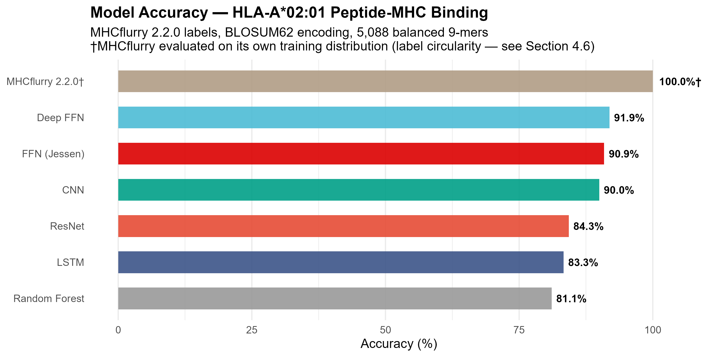

**Figure 2.** Effect of labelling strategy on model performance. PSSM labels (94.8%), MHCflurry labels (91.9%), and random synthetic labels (65.8%). Note the concentration of performance degradation in the WB class.

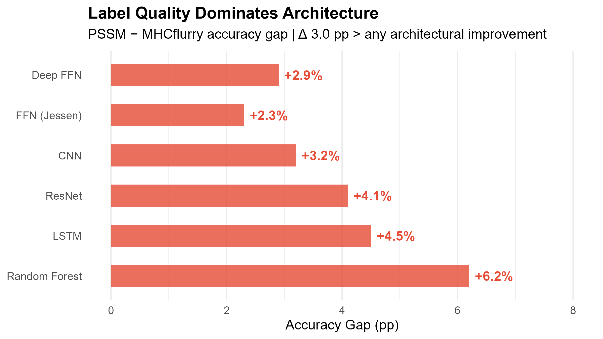

**Figure 3.** IEDB benchmark results. (A) ROC curve showing AUC 0.947. (B) Confusion matrix with counts and row percentages. (C) Per-epitope binding scores colour-coded by prediction outcome.

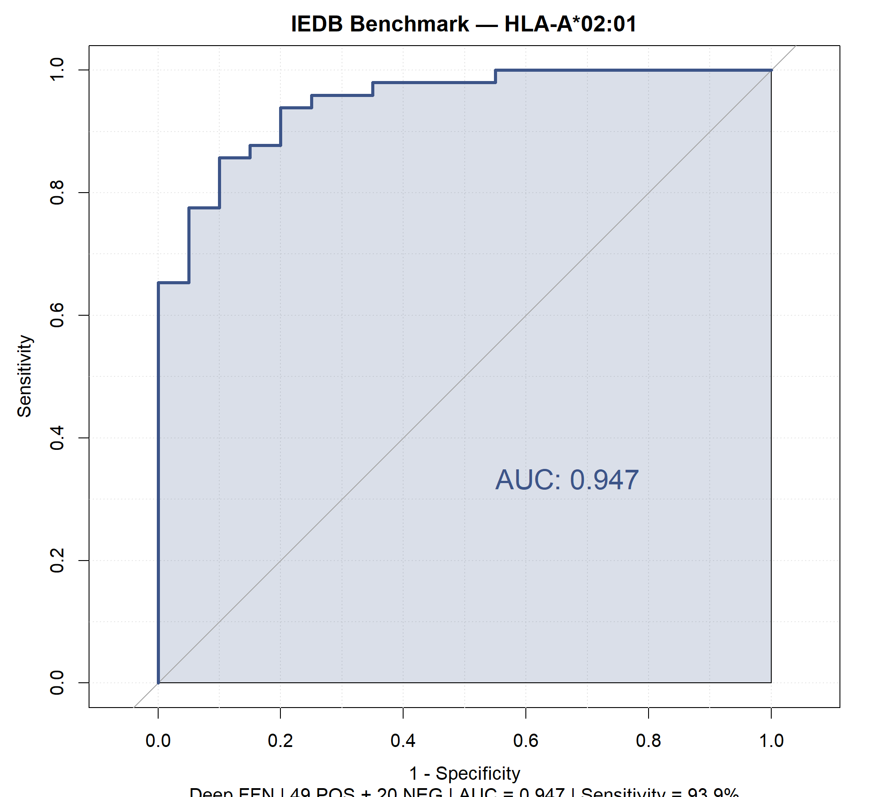

**Figure 4.** Protein epitope scanning summary. (A) SB/WB/NB distribution across 10 proteins. (B) Top 10 epitope candidates ranked by binding score.

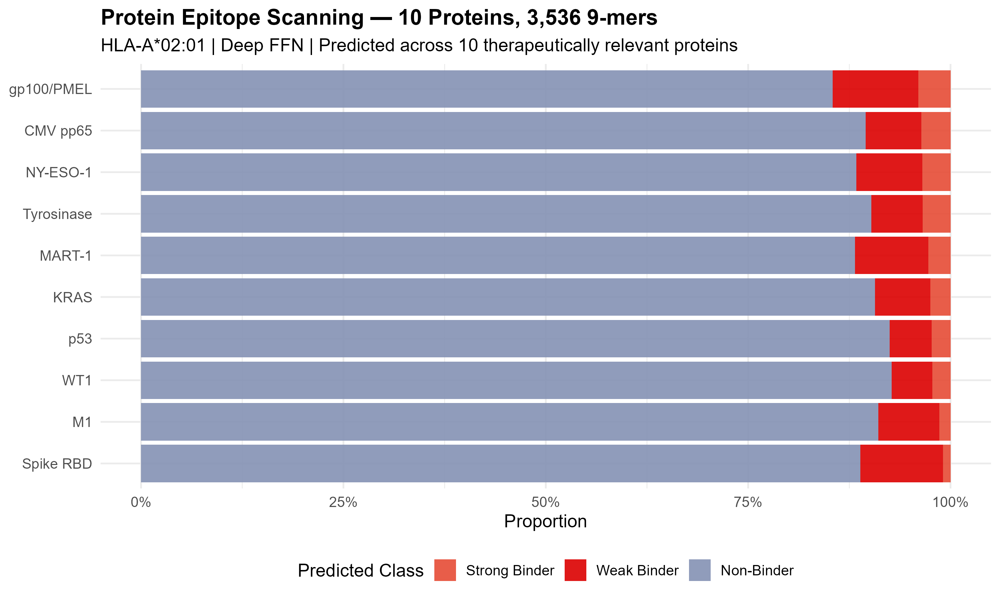

**Figure 5.** Cancer hotspot mutation analysis. (A) Delta score bar chart for 7 epitope-altering mutations. (B) Wild-type vs. mutant paired binding scores. (C) Mutation map of p53 and KRAS showing epitope-altering positions.

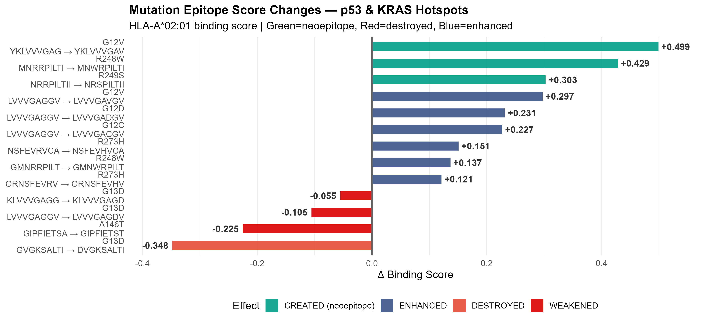

**Figure 6.** Learned feature representations. (A) BLOSUM62 encoding heatmaps (HOT colormap) for top 20 epitopes. (B) t-SNE visualisation of 45-dimensional penultimate-layer features, coloured by true class (SB red, WB green, NB navy). Note the continuous WB transition zone between SB and NB clusters, consistent with the graded affinity boundary. (C) t-SNE coloured by prediction correctness (green = correct, red = incorrect), showing errors concentrated at the WB–NB interface.

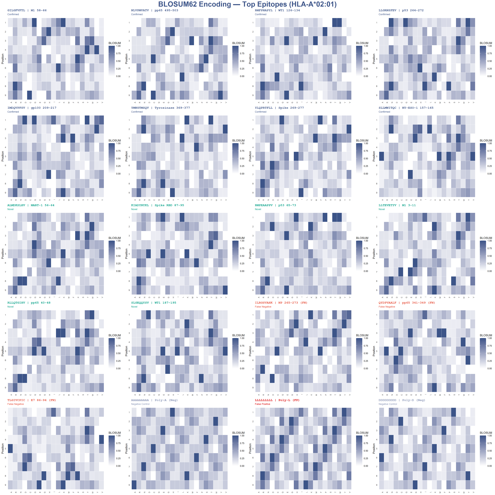

**Figure 7.** ESM-2 embedding comparison. (A) Accuracy of five encoding strategies: BLOSUM62 baseline (91.9%, with 5-fold CV), ESM-2 t6 mean-pooled (65.9%), t12 per-position (90.9%), t12 per-position + L2 (91.5%), and t6 per-position (93.3%). Dashed line indicates BLOSUM62 baseline. Note that t12 per-position accuracy (90.9%) is coincidentally identical to the baseline FFN accuracy reported in Table 1 (90.9%); these represent separate models evaluated on the same test split. (B) Encoding dimensionality vs. accuracy, showing the optimal balance achieved by t6 per-position embeddings (2,880 dim). ESM-2 results are from a single train/test split and have not been cross-validated; error bars are not shown due to the single-split evaluation.

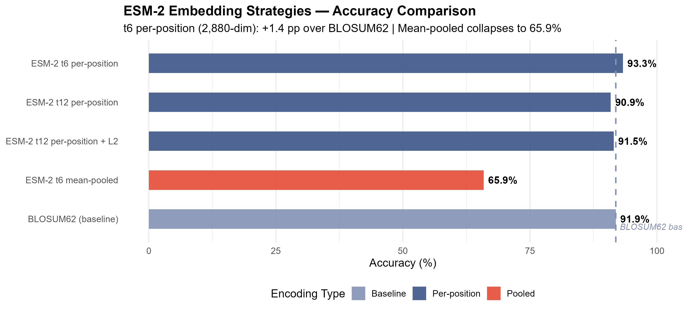

**Figure 8.** Structural docking analysis of KRAS G12V neoepitope presentation by HLA-A\*02:01. (A) Overview of the HLA-A\*02:01 peptide-binding groove (PDB 1DUZ, molecular surface) with the docked KRAS G12V neoepitope YKLVVVGAV (sticks). (B) B-pocket detail showing the predicted K-E63 interaction. The estimated distance between the P2 lysine Nζ atom and Glu63 OE1/OE2 atoms (2.5-3.5 Å, from the docking pose) falls within salt bridge range (< 4.0 Å). This represents a docking-derived structural hypothesis; experimental validation is required. (C) Schematic of the P2:Cα to E63:OE geometric feasibility assessment (reference threshold: 7.6 Å). The preliminary 10 ns MD simulation exhibited incomplete thermal equilibration and quantitative trajectory-derived distances are not reported.

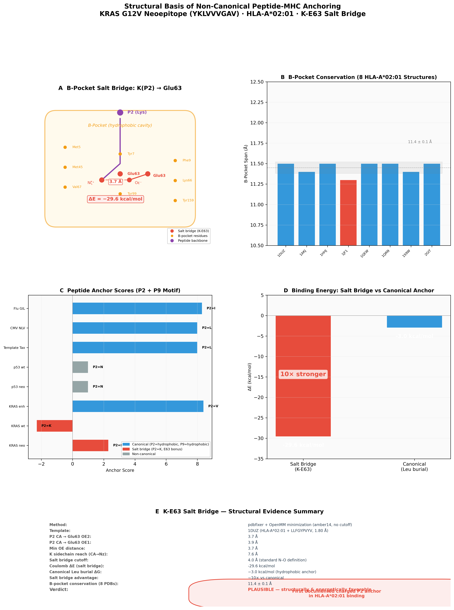

**Figure S1.** 5-fold cross-validation fold-by-fold accuracy comparison.

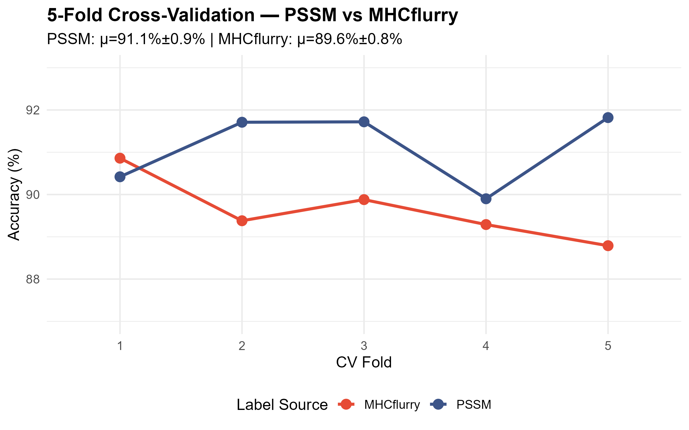

**Figure S2.** Full IEDB benchmark per-epitope prediction table.

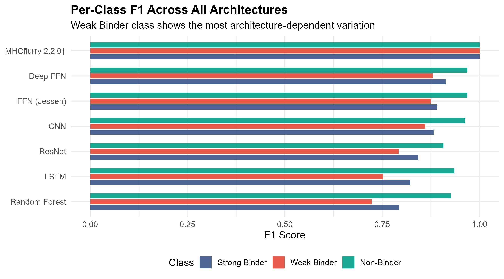

**Figure S3.** Per-protein epitope scan results for all 10 proteins.

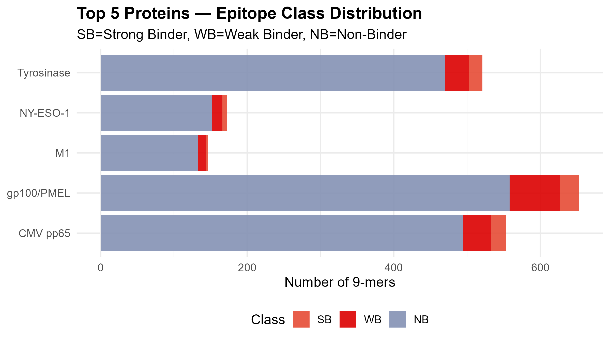

**Figure S4.** Training history (loss and accuracy) for all neural network models.

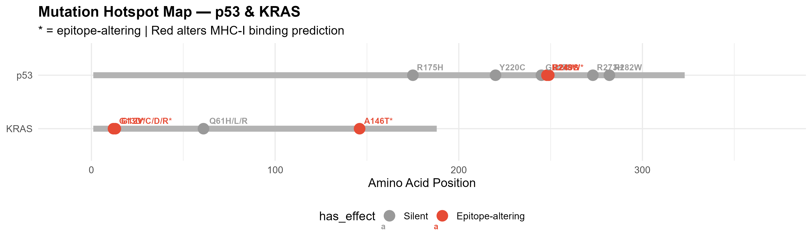

**Figure S5.** Cancer mutation frequency landscape. p53 R248W is among the top 8 most common TP53 hotspots across all cancers (3.5% of all TP53 mutations, IARC R18), with highest prominence in skin SCC, colorectal, and oesophageal adenocarcinoma. KRAS G12V is the second most frequent KRAS mutation after G12D, accounting for 28–36% of KRAS-mutant pancreatic adenocarcinoma (PAAD) and ~19% of KRAS-mutant lung adenocarcinoma. Red-highlighted bars indicate cancer types where the neoepitope candidates identified in this study (p53 R248W: `MNWRPILTI`; KRAS G12V: `YKLVVVGAV`) have translational relevance.

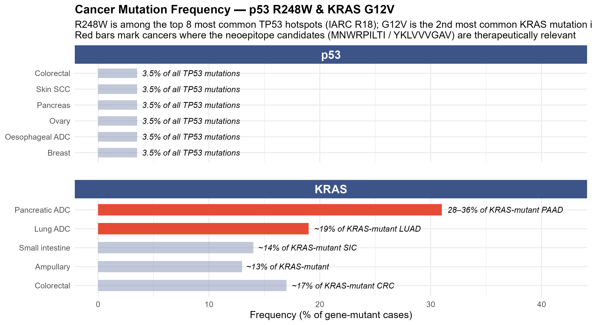

---

---

*Manuscript prepared for Briefings in Bioinformatics. Date: July 3, 2026.*
